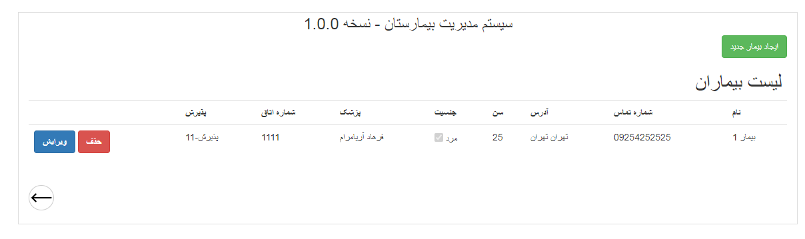
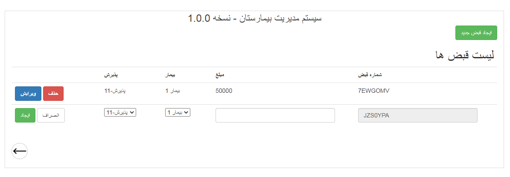

## Publish
<h3>Project published on this url</h3>
<h3>http://farhadariamaram.somee.com/</h3>

## Overview
- Hospital Management System web application
- ASP .NET MVC
- Micosoft SQL Server
- Bootstrap 3.0
- JQuery

## Requirements

- .NET Framework 4.7.2

- Microsoft SQL Server 14.0

## Screenshot
- Application
  
  
  
  
  
  

## License

- Apache 2.0

